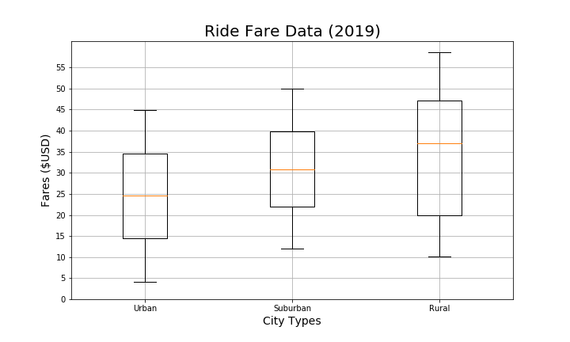
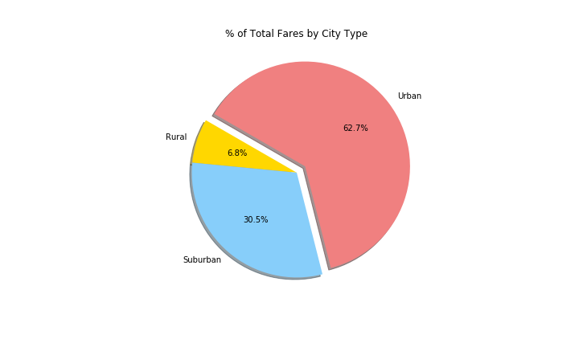
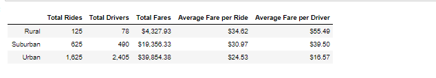
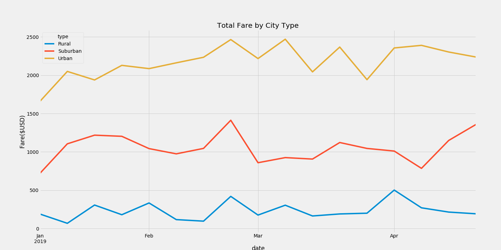

# PyBer_Analysis
Analyze all the rideshare data from January to early May of 2019 and create a compelling visualization for the CEO, V. Isualize.

## Resources
- Data sources: [City_Data.csv](Resources/city_data.csv), [Ride_Data.csv](Resources/ride_data.csv) 
- Software : Python 3.7, Anaconda, Jupyter Notebook

## Overview of the project 

The objective of this assignment is to produce an analysis and visualization to help PyBer improve access to ride-sharing services for all city types, by creating a multiple-line graph that shows the total weekly fares for each city type, whether that be Urban, Suburban, or Rural cities. The analysis and visulaization will also help PyBer determine affordability for underserved neighborhoods.

Previously, we analyzed the ride count, average fare per ride, and average number of drivers, all categorized by the type of city. Additionally, we compared each city's metrics and the average ride fare to the total number of rides per city. 

For this challenge, we took it a step further and created a summary data frame that organized total rides, total drivers, total fares, average fare per ride, and average fare per driver and the multiple line plot.

First, we pulled our data by using the pandas Groupby() function with the count() and sum () to get the total number of drivers,rides and fares by city type. Once we pulled this information and assigned it to functions we were able to calculate our average fare per ride and driver. Once we had all of that information together we were able to format into a newdata frame and re-format the columns. In the second part of this excercise we used the pivot() and resample function to create a multiple line graph that shows the total fares for each week by city type between the months of January & April of 2019.

## Results
I- PyBer Summary

 1- Total Ride by city type

The PyBer Summary DataFrame provides an overview comparison of PyBer's ridesharing services in three types of cities: **rural, surburban, and urban cities**. The summary demonstrates that there is a larger demand for PyBer among riders in urban cities compared to suburban and rural cities. 
Between January 2019 and May 2019, there were:
- 1,625 rides in urban cities.
- 625 rides in suburban cities.
- 125 rides in rural cities. 

The figure below highlights how rides in Urban cities contributed the most to PyBer's overall rides during this five-month period.

 2- Total drivers by city type

On a similar pattern, there was also a larger volume of drivers in urban cities compared to suburban and rural cities:
- There were 2,405 drivers in urban cities.
- 490 drivers in suburban cities.
- 78 drivers in rural cities. 

Again, the figure below depicts the significance of drivers in urban cities during this time period.

 
 
  3- Total fare by city type
 
Given that there is a greater usage of PyBer in urban cities, the total fares are consequently also higher than suburban and rural cities. 
- PyBer transactions in urban cities totaled nearly $40,000.
- Suburban cities totaled at least $19,000.
- Rural $4,000. 

The figure below demonstrates where the majority of PyBer's revenue occurred during this time period: urban cities.

 4- Average fare by ride

- In terms of costs, it appears that riders in rural cities pay on average almost $10 more for PyBer than riders in urban cities. The average fare per ride is $34.62 in rural cities whereas the average fare per ride is $24.52 in urban cities.

- Suburban cities average fare per ride falls just about $31, While it may not be good news for riders in rural cities, it is a better market for drivers in this type of city. 

 5- Average fare by driver

- The average fare per driver is about $55 in rural cities, whereas the average fare per driver is about $17 in urban cities. Suburban cities' average fare per driver is about $40.

The image below show the summary of the PyBer.

 6- Multiple line chart 
 
 
 
 
According to the plot, urban cities have the highest fares and all cities have a high peak just before the month of March. Sururban cities have lower fares compared to urban cities but higher fares compared to rural cities which have the lowest fares.

Rural Pyber users on average should expect to pay more for rides. Cities by nature have higher populations, leading to a bigger driver pool and allowing Pyber users to get lower fares.

## Summary

To sum up all the finds about the ridsahring data frame summary, we can aggregate them like the following:

- There are significantly more rides in Urban cities than Suburban or Rural.
- The number of drivers also follows that same pattern with more drivers being in Urban cities.
- The majority of Pyber's revenu occurs most in urban cities.
- The average fare per ride and average fare per driver are actually most expensive in the rural areas and cheaper in the Urban cities.
- Ride share service has more drivers available the ride expenses or fares become cheaper on average.

Overall, PyBer ridersharing services significantly differs in rural, suruban, and urban cities given the number of rides, drivers, and fares. Data supports that there is higher usage of PyBer ridesharing services in urban cities.

## Recommandations
3 Recommandations that i can provide:

- Since drivers in rural cities are earning more than drivers in urban cities. This could discourage potential drivers from working with PyBer given the low average fare per driver. For that fact, I suggest Pyber to enforce the number of drivers in suburban and rural cities and encourage drivers by giving bonus points or incentive programs to work more in rural and suburban areas.

- 

